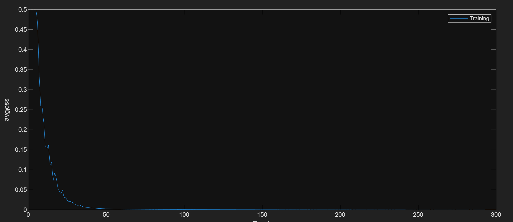

# orl-face-recognition
使用 ORL 人臉資料集，比較兩種人臉辨識方法

## 環境需求
- MATLAB / Octave
- ORL 32x32 人臉資料集(解壓縮後使用進入第一層路徑執行)

## 方法一：PCA + LDA + 最近距離分類
- 使用 PCA (降至 50 維) 去除雜訊與壓縮特徵
- 使用 LDA (降至 30 維) 增強類別可分性
- 以各類別的投影均值作為中心點，測試樣本使用「最小距離法」分類
- 顯示 3D LDA 投影的可視化結果

## 方法二：PCA + Max-Min Normalization + BackPropagation Neural Network
- 使用 PCA (降至 65 維) + Max-Min Normalization (縮放至 [0,1])
- 建立一個簡單的前饋神經網路：
  - 輸入層：65 維
  - 隱藏層：300 神經元 (Leaky ReLU)
  - 輸出層：40 類 (Softmax)
- 損失函數：Cross-Entropy
- 使用 BP (反向傳播) 訓練，繪製 Loss 曲線並計算測試集準確率

